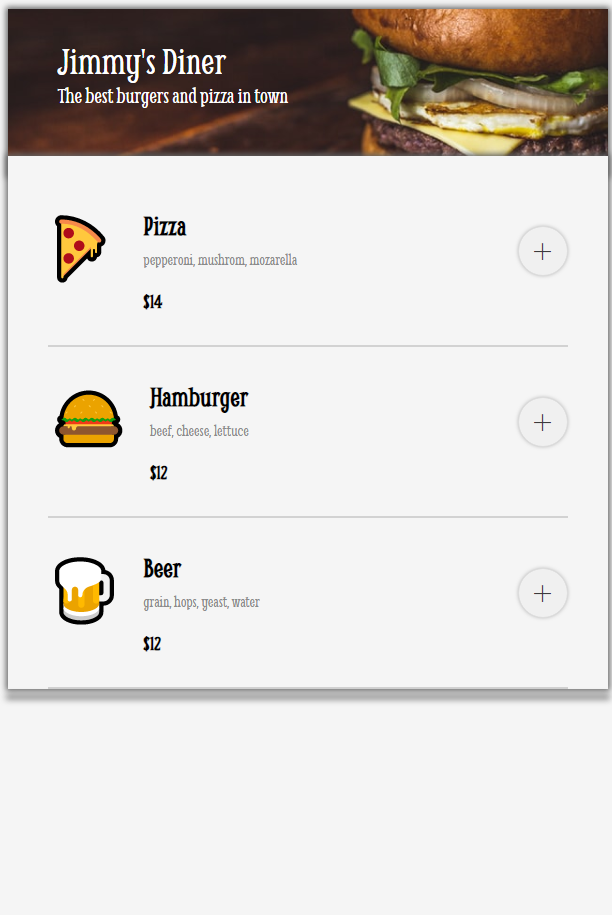
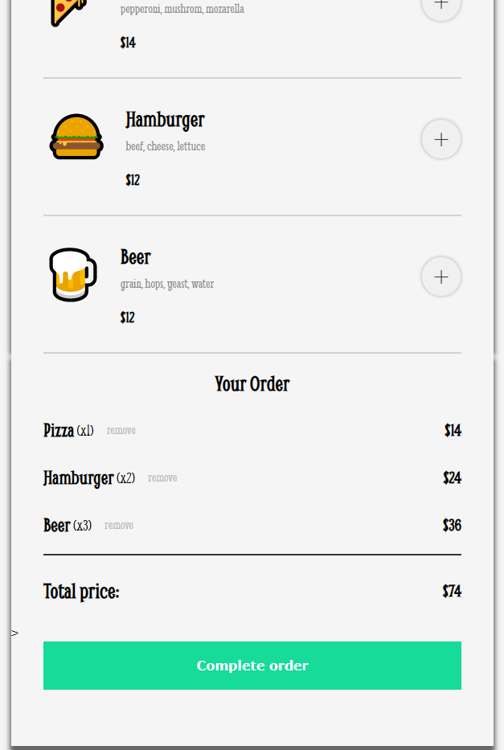
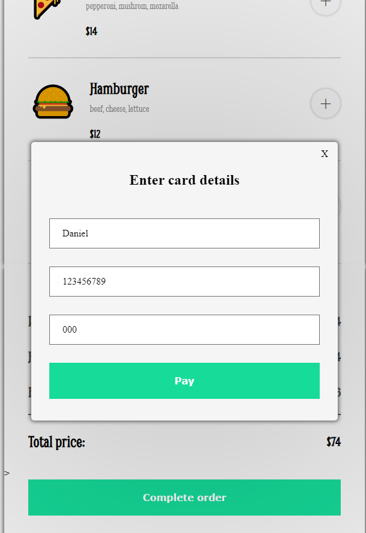
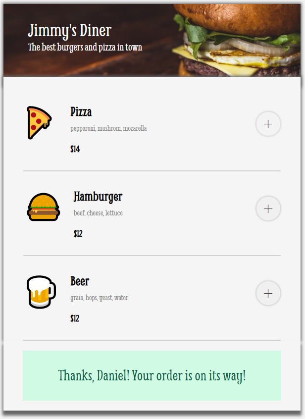

# Restaurant Ordering App 

Restaurant Ordering App Solo Project from [Scrimba](https://scrimba.com/learn/frontend)'s Essential JavaScript concepts module.

## Project Link

[Project Link](https://restaurant-ordering-scrimba.netlify.app/) Hosted using Netlify 

## Previews
 
 

## Project Functionality

- Add/Remove food items to/from cart.
- Generate checkout that shows each item, amount of items, and items cost from cart.
- Generate the total price. 
- Generate payment form that takes user's name, card number, and cvv number.
-Generate order confirmation message with user's name after payment.  